# 프로젝트 구조와 동작 지도

이 문서는 `Risu Asset Extractor`가 무엇을 어디서 처리하는지 한 번에 보기 위한 지도다.

## 전체 흐름

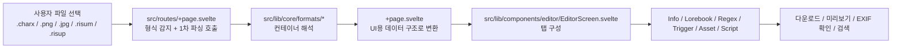

## 파일 종류별 처리 경로

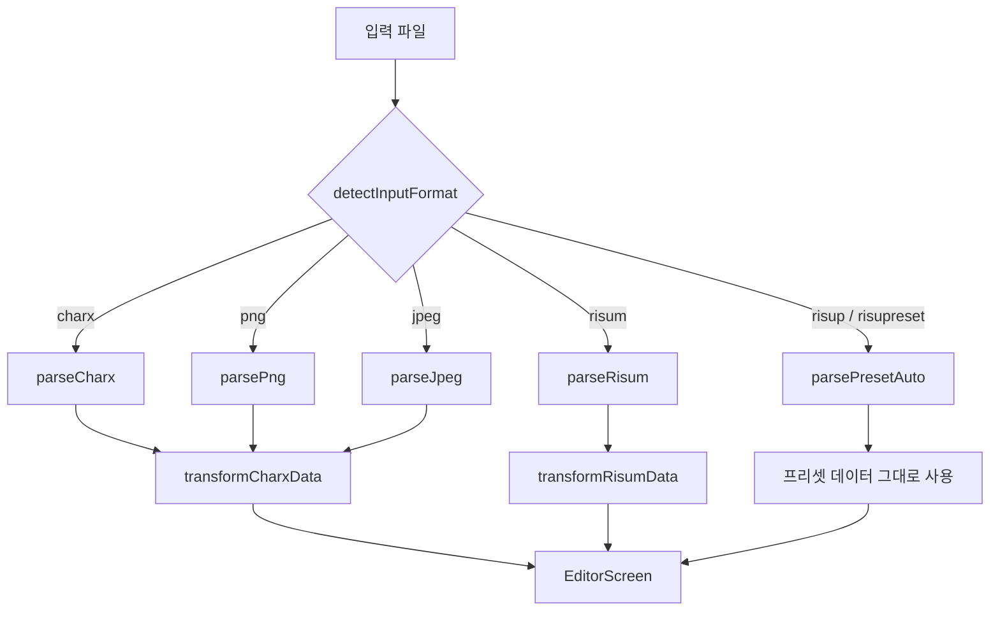

## 폴더 역할

### `src/routes`

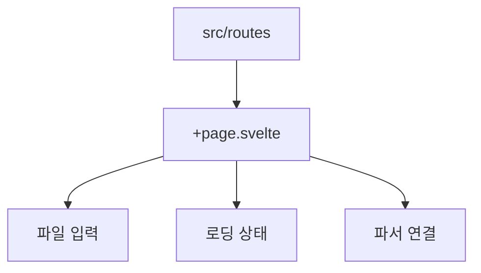

### `src/lib/core`

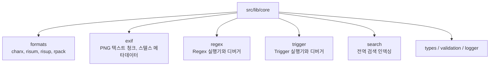

### `src/lib/components/editor`

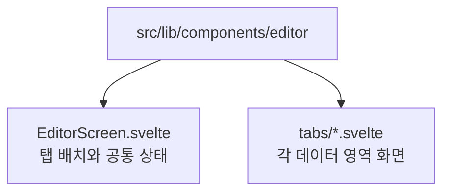

### `tests`

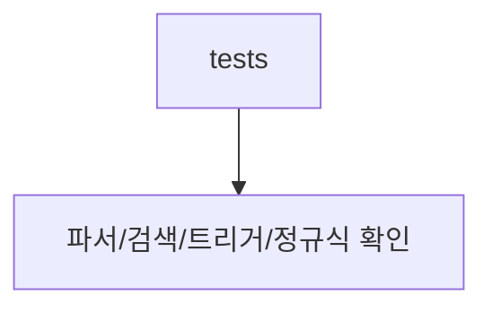

### `docs/risupack-format`

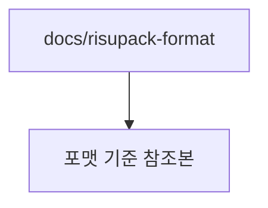

## 화면이 데이터를 보는 방식

### 1. 봇 카드 계열

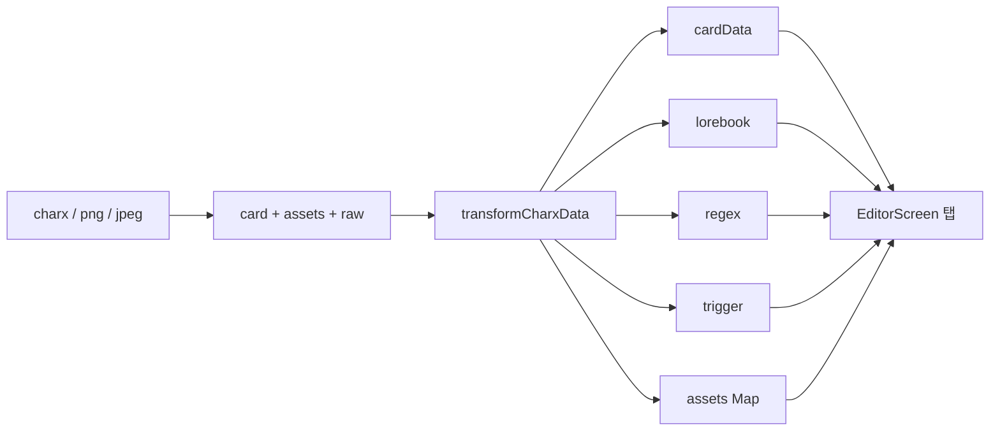

### 2. 모듈 계열

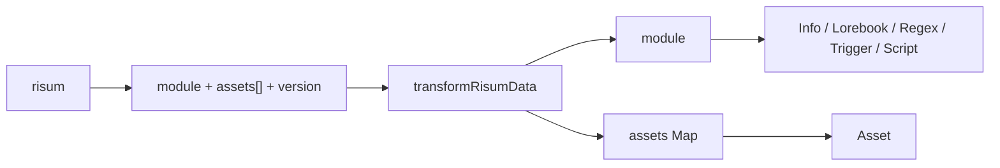

### 3. 프리셋 계열

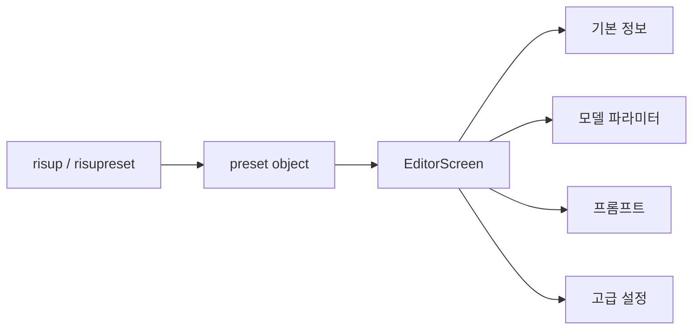

## 에셋 탭이 맡는 일

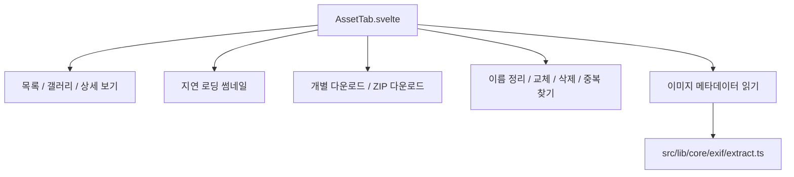

## 검색과 디버깅의 위치

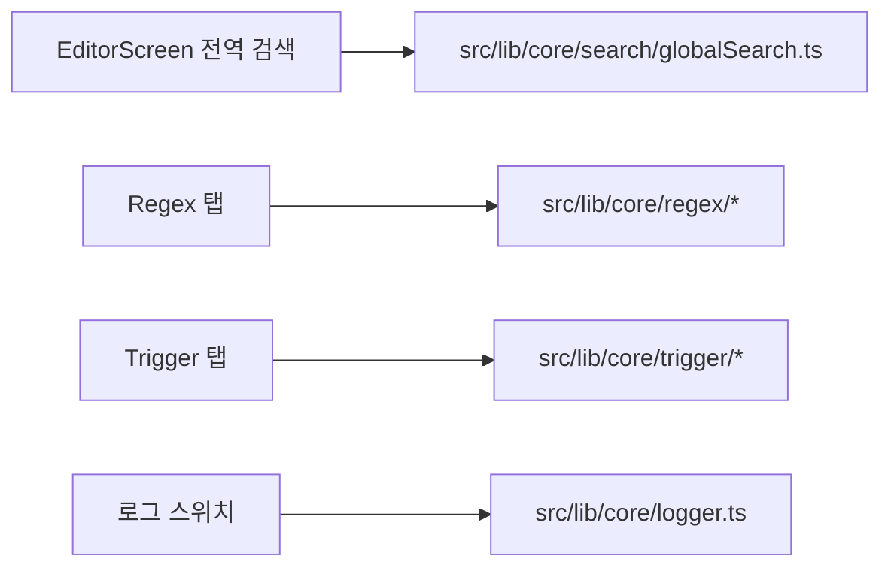

## 이 저장소를 읽는 순서

1. `src/routes/+page.svelte`
2. `src/lib/components/editor/EditorScreen.svelte`
3. `src/lib/components/editor/tabs/AssetTab.svelte`
4. `src/lib/core/formats/charx.ts`
5. `src/lib/core/formats/risum.ts`
6. `src/lib/core/exif/extract.ts`

## 빠른 요약

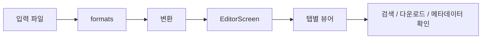
